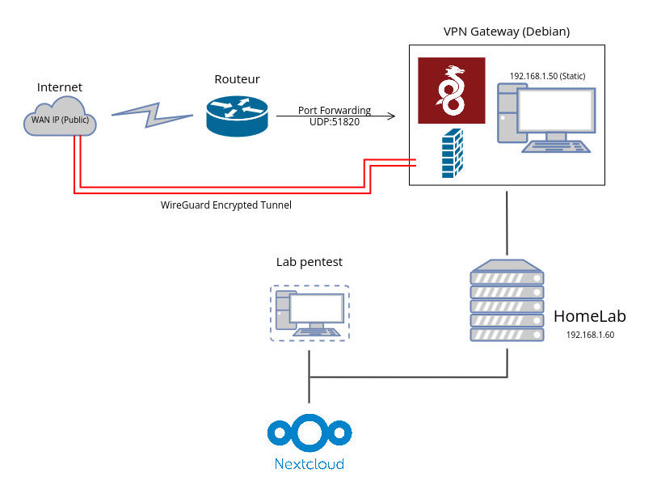

# Secure Remote Access Gateway for Home Lab

## 1. Pourquoi mettre en place un VPN pour accéder à son homelab ? 
Aujourd’hui, face à la multiplication des cyberattaques, nos réseaux domestiques sont constamment ciblés par des scanners automatisés à la recherche de vulnérabilités. Afin de protéger mon infrastructure et de réduire ma **surface d’exposition**, j'ai choisi d'implémenter un **VPN (Virtual Private Network)**. Cette solution me permet d'accéder à mes ressources locales de manière sécurisée et chiffrée, sans jamais exposer mes services directement sur l'Internet public.

## 2. Les outils utilisés
| Outil | Rôle | Documentation |
|:-------:|:---------:|:---------:|
| WireGuard | Tunnel VPN | [Documentation Tunnel (CloudFlare)](https://www.cloudflare.com/fr-fr/learning/network-layer/what-is-tunneling/)
| UFW | Pare-Feu | [Documentation Pare-Feu (Blog)](https://blog.stephane-robert.info/docs/securiser/reseaux/ufw/)|
| Fail2Ban | Protection Brute-Force | [Documentation Brute-Force (Fail2Ban ENG)](https://fail2ban.readthedocs.io/en/latest/)|
| Docker (Optionnel) | Déploiement | [Documentation Déploiement (Docker ENG)](https://docs.docker.com/) |

## 3. Exemple d'architecture



### Description de l'architecture :

- Ingress : Le routeur redirige uniquement le trafic UDP 51820 vers la Gateway Debian. Tous les autres ports sont fermés à l'extérieur.

- Security Layer : La Gateway combine WireGuard pour le tunnel chiffré et UFW/Fail2Ban pour le filtrage et la protection contre les intrusions.

- Isolation : Le Lab Pentest et le service Nextcloud sont isolés du Web public. Ils ne sont accessibles qu'une fois le tunnel VPN établi, via leurs IP privées en 192.168.1.X.

## 4. Mesures de sécurité et choix techniques

Le choix de l'architecture et des outils a été guidé par une volonté de performance et de sécurité maximale (principe du moindre privilège).

### A. Pourquoi avoir choisi WireGuard ?

Bien qu'OpenVPN soit un standard historique, j'ai opté pour WireGuard pour plusieurs raisons clés :

- **Performance** : WireGuard offre des débits supérieurs et une latence réduite grâce à son implémentation dans le noyau Linux (Kernel).

- **Code moderne** : Sa base de code est environ 10 fois plus légère que celle d'OpenVPN, ce qui réduit considérablement la surface d'attaque et facilite les audits de sécurité.

- **Discrétion** : Contrairement à d'autres protocoles, WireGuard ne répond pas aux paquets non authentifiés, rendant le port VPN invisible aux scanners de ports.

### B. Hardening du service SSH

Afin d'éviter toute intrusion sur la machine Debian, j'ai appliqué des mesures de durcissement (hardening) sur le service SSH :

- **Authentification par clés Ed25519** : Remplacement des mots de passe par des clés cryptographiques asymétriques, beaucoup plus résistantes aux attaques.

- **Désactivation de l'accès par mot de passe** : Suppression totale du risque d'attaque par brute-force sur les identifiants.

- **Changement du port par défaut** : Déplacement du service SSH sur un port non standard pour limiter les tentatives de connexion automatiques des bots.

### C. Stratégie du Pare-feu (UFW)

La sécurité réseau repose sur une politique de "Default Deny" (tout ce qui n'est pas explicitement autorisé est interdit) :

- **Blocage total** : Tous les flux entrants sont rejetés par défaut.

- **Ouverture sélective** : Seul le port UDP 51820 dédié à WireGuard est ouvert vers l'extérieur. Les autres services (Nextcloud, Lab Pentest) ne sont accessibles qu'une fois à l'intérieur du tunnel chiffré.

### D. Protection proactive avec Fail2Ban

Pour compléter ce dispositif, j'ai déployé Fail2Ban. Cet outil analyse les logs système en temps réel et bannit automatiquement les adresses IP présentant un comportement suspect (tentatives d'intrusion répétées), protégeant ainsi le serveur contre les scanners de vulnérabilités.

## 5. Guide d'installation
Le déploiement a été réalisé sur une instance **Debian 12 (Bookworm)**. Voici les étapes majeures de la mise en place.
### 5.1 Mise à jour du système
Avant toute installation, le système est mis à jour pour garantir la présence des derniers patchs de sécurité.

```bash
sudo apt update && sudo apt full-upgrade -y
```

### 5.2 Déploiement de WireGuard (via Pi-VPN)

L'utilisation de l'outil **Pi-VPN** a permis une configuration optimisée du protocole WireGuard, gérant automatiquement la création des interfaces réseau virtuelles.

```bash
curl -L https://install.pivpn.io | bash
```

> **Choix techniques** : Sélection du protocole WireGuard (port UDP 51820) et utilisation de serveurs DNS sécurisés pour éviter les fuites DNS.

### 5.3 Configuration du routage

Pour que le trafic transite correctement, l'IP Forwarding doit être activé au niveau du noyau Linux :

1. Dans le fichier `/etc/sysctl.conf`, ajoutez ou modifiez `net.ipv4.ip_forward=1` pour qu'elle soit à 1.

2. Appliquez les changements immédiatement sans redémarrer :
    ```bash
    sudo sysctl -p
    ```
3. Sur l'interface du routeur, créez une règle de redirection de port (DNAT) : `UDP:51820` vers l'IP statique du serveur Debian.

### 5.4 Hardening et Sécurisation
L'isolation du lab est assurée par le pare-feu UFW et la protection Fail2Ban. Nous appliquons une politique de "Default Deny" (tout ce qui n'est pas autorisé ne rentre pas).
```bash
# Configuration du pare-feu
sudo ufw default deny incoming
sudo ufw allow 51820/udp   # Port du VPN WireGuard
sudo ufw allow 45222/tcp   # Port SSH personnalisé (sécurité par l'obscurité)
sudo ufw enable

# Installation et activation de Fail2Ban
sudo apt install fail2ban -y
sudo systemctl enable --now fail2ban
```

### 5.5 Gestion des clients et accès distant

La création des profils utilisateurs se fait de manière simplifiée, permettant une connexion rapide via un QR Code ou un fichier de configuration `.conf`.
```bash
# Génération d'un nouveau profil client
pivpn add
# Affichage du QR Code pour scan mobile
pivpn -qr
```

## 6. Tests et Validation

Un projet d'infrastructure n'est complet que s'il est testé. J'ai réalisé deux types de tests pour valider la sécurité et la connectivité.

### 6.1 Audit externe (Le point de vue de l'attaquant)

L'objectif est de vérifier que le serveur est bien "invisible" sur Internet. J'ai utilisé l'outil Nmap depuis un réseau externe (connexion 4G) pour scanner l'IP publique de ma Gateway.

```bash
# Scan des ports TCP les plus courants
nmap -Pn -sS -p 1-1000 [IP_PUBLIQUE]

# Scan spécifique du port UDP de WireGuard
sudo nmap -Pn -sU -p 51820 [IP_PUBLIQUE]
```

#### Explication des options : 

- -Pn : Permet de considérer que les hôtes sur lesquels on scanne les ports sont en ligne.

- -sS (**Scan SYN TCP**) : Cette option envoie un paquet SYN mais n'établit jamais la connexion TCP.
- -p : Permet de scanner les ports spécifiés, ici les ports de 1 à 1000 et le port 51820.

- -sU : Correspond à un scan UDP.

#### Nous obtenons comme résultat : 

- Ports TCP : Tous les ports apparaissent comme filtered (le pare-feu UFW rejette les paquets sans répondre).

- Port UDP 51820 : Apparaît comme open|filtered. C'est le comportement normal de WireGuard : il ne renvoie aucun paquet (stealth mode) si la requête n'est pas signée par une clé autorisée.

- Conclusion : Aucun service (SSH, Nextcloud, Lab) n'est détectable de l'extérieur.

### 6.2 Test de connectivité (Le point de vue utilisateur)

Une fois le client WireGuard activé sur mon smartphone, j'ai vérifié l'accès aux ressources privées.

- Vérification de l'IP virtuelle : Mon appareil a bien reçu l'IP 10.6.0.2.

- Accès au Home Lab : Un ping vers l'IP locale du serveur Nextcloud (192.168.1.60) répond avec succès.

- Navigation sécurisée : L'accès à l'interface web de Nextcloud fonctionne via son IP privée, prouvant que le routage à travers le tunnel chiffré est opérationnel.

### 6.3 Test de fuite DNS (DNS Leak Test)

Pour garantir l'anonymat et la sécurité, j'ai vérifié que mes requêtes DNS passent bien par le tunnel VPN et non par le fournisseur d'accès local.

- Outil : dnsleaktest.com

- Résultat : Seuls les serveurs DNS configurés dans Pi-VPN (ex: Cloudflare ou Unbound) sont visibles.
