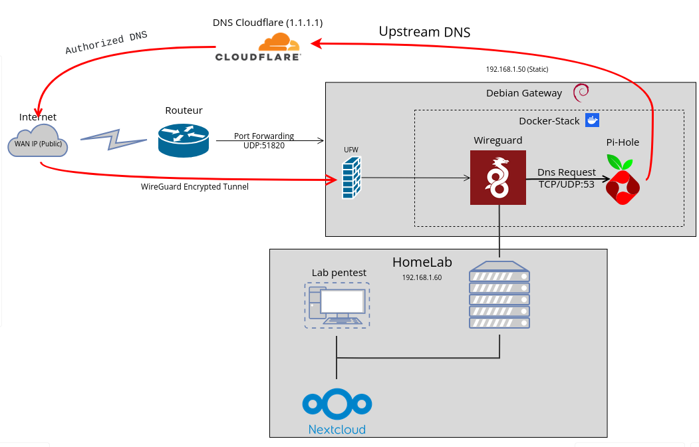

# Secure DNS & VPN Gateway

## Présentation du Projet

Ce projet documente la mise en place d'une passerelle d'accès à distance sécurisée (Secure Remote Access Gateway) pour un Home Lab. L'objectif principal est de permettre un accès chiffré et sécurisé aux services hébergés localement (Nextcloud, Lab de Pentest, etc.) depuis l'extérieur, sans jamais exposer ces services directement sur l'Internet public.

## Prérequis

Avant de commencer, assurez-vous de disposer des éléments suivants :
- Un serveur sous **Debian 12** (ou autre distribution Linux stable).
- **Docker** et **Docker Compose** installés.
- Un accès à l'interface de votre routeur pour rediriger le port **UDP 51820**.
- Une IP publique statique ou un service de DNS dynamique (DDNS).

## Architecture et Fonctionnement

Le système est conçu autour du principe du moindre privilège et d'une politique de sécurité "Default Deny". 

## Durcissement du Système Hôte (Hardening)

Pour garantir la sécurité de la passerelle, les mesures suivantes sont appliquées sur le serveur Debian :
- **Pare-feu (UFW)** : Politique par défaut à `deny`. Seuls les ports VPN et SSH (port personnalisé) sont ouverts.
- **Fail2Ban** : Protection contre le brute-force avec bannissement automatique des IPs suspectes.
- **Sécurisation SSH** : Désactivation de l'authentification par mot de passe, utilisation de clés Ed25519 uniquement, et changement du port par défaut.
- **Mises à jour automatiques** : Installation du paquet `unattended-upgrades` pour garantir que les patchs de sécurité sont appliqués quotidiennement.

### Composants Clés :
- **Ingress Routeur** : Redirige uniquement le trafic UDP nécessaire vers la Gateway Debian.
- **WireGuard (via Pi-VPN)** : Fournit le tunnel VPN chiffré, sélectionné pour sa légèreté, ses performances (intégré au noyau Linux) et sa discrétion (ne répond pas aux paquets non authentifiés - Stealth mode).
- **UFW (Pare-Feu)** : Applique une politique stricte de blocage par défaut, n'autorise que le port d'écoute du VPN.
- **Fail2Ban** : Protège contre les attaques par force brute (notamment sur le SSH) et bannit automatiquement les comportements suspects.
- **Hardening Système** : Sécurisation du service SSH via l'utilisation exclusive de clés cryptographiques Asymétriques (Ed25519) et le changement du port par défaut.

## Guide d'Installation et de Déploiement

Toutes les étapes détaillées pour reproduire cette infrastructure de sécurité, depuis la préparation du serveur Debian jusqu'aux tests de validation (Nmap, DNS leak), sont disponibles dans le document d'installation dédié :
 
**[Consulter le Guide d'Installation complet](./Doc/Install.md)**

### Résumé des Étapes :
1. Mise à jour de la distribution (Debian 12 - Bookworm).
2. Déploiement de WireGuard (Pi-VPN).
3. Configuration du routage réseau (IP Forwarding).
4. Mise en place du pare-feu (UFW) et de la protection active (Fail2Ban).
5. Sécurisation du SSH et gestion des accès clients distants.
6. Phase d'audits et de tests.

## Évolutions et Sécurité Avancée

J'ai décider d'ajouter un **DNS Sinkhole (Pi-Hole)** pour limiter l'affichage de pubs sur internet et limiter les traqueurs au niveau réseau

## Sécurité et Validation

L'infrastructure a été validée par plusieurs tests pour s'assurer de sa robustesse :
- **Audit externe (Nmap)** : Prouvant l'invisibilité des ports et des services depuis l'extérieur.
- **Tests de connectivité** : Confirmant l'accès fluide et exclusif aux ressources locales une fois le tunnel établi.
- **DNS Leak Tests** : Garantissant qu'aucune requête DNS n'est divulguée en dehors du tunnel chiffré.
